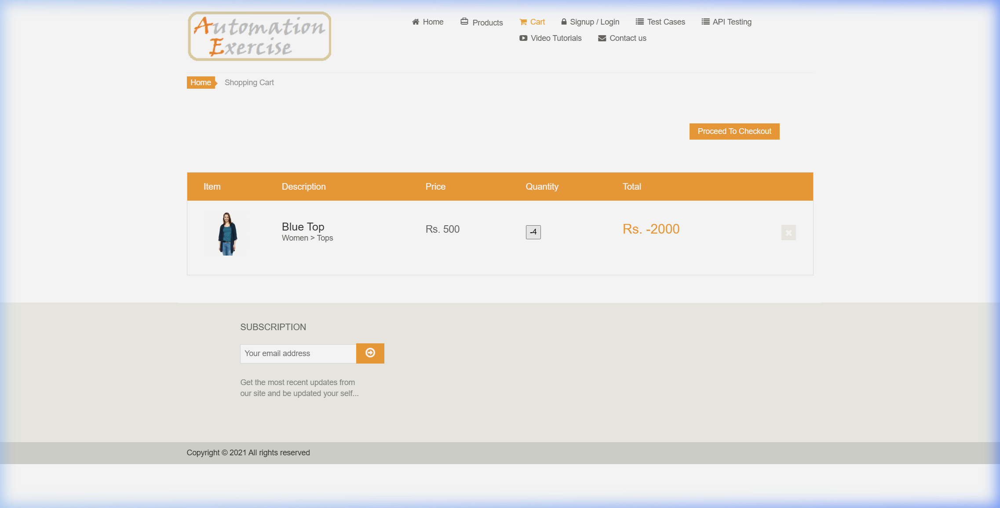
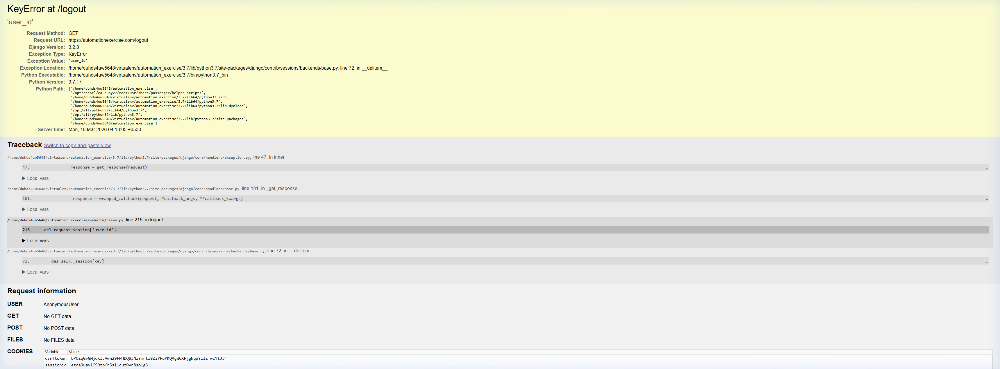
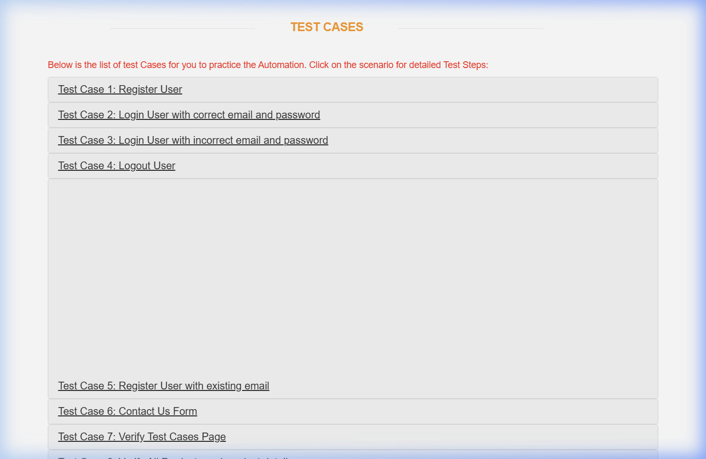
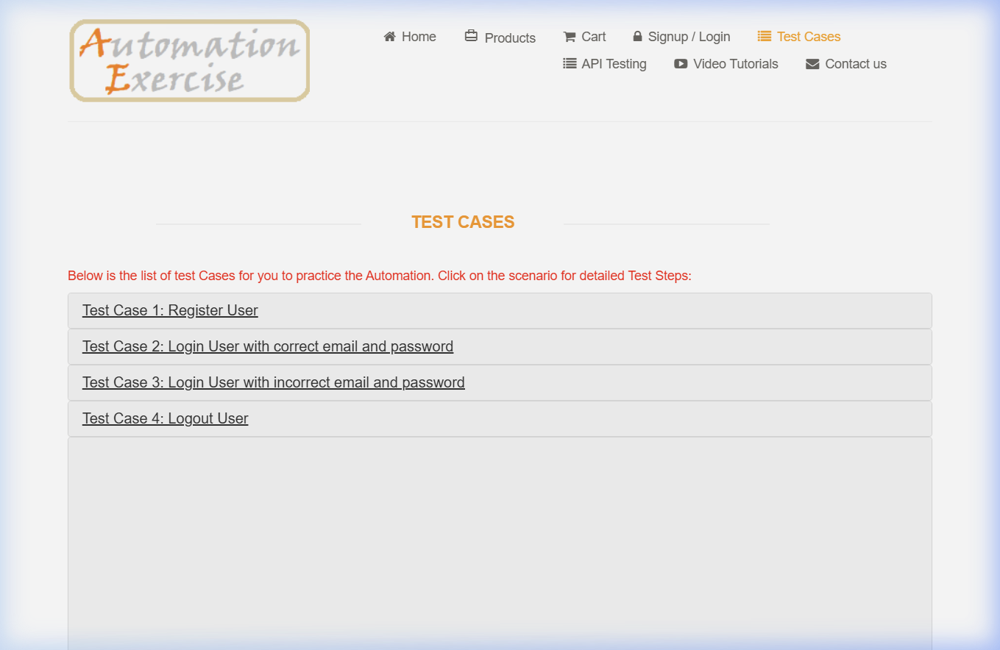

# Bug Bash Session Report: Automation Exercise

**Date:** March 16, 2026
**Target URL:** [https://automationexercise.com/](https://automationexercise.com/)
**Tester:** Antigravity (QA Specialist)

---

## 📈 Executive Summary
A comprehensive manual testing session was conducted on the Automation Exercise platform. A total of **15 bugs** were identified, categorized as follows:
- **Critical:** 3
- **High:** 2
- **Medium/Low:** 10

The system exhibits significant stability and security issues, most notably a server-side exception on logout and the ability to finalize orders with negative totals.

---

## 🐞 Critical & High Severity Bugs

### 1. [CRITICAL] Negative Total Calculation in Shopping Cart
*   **Summary:** User can add a negative quantity of items to the cart, resulting in a negative total order amount.
*   **Severity:** Critical (Business Logic/Pricing Failure)
*   **Steps to Reproduce:**
    1. Navigate to any product detail page (e.g., `/product_details/1`).
    2. In the quantity field, enter `-5`.
    3. Click "Add to cart".
    4. Click "View Cart".
*   **Expected Result:** System should validate quantity to be at least 1.
*   **Actual Result:** System accepts negative quantity and calculates a negative total (e.g., Rs. -2500).
*   **Evidence:** 

### 2. [CRITICAL] Server-Side KeyError at /logout
*   **Summary:** Accessing the logout URL while unauthenticated triggers a 500 Internal Server Error.
*   **Severity:** Critical (System Stability)
*   **Steps to Reproduce:**
    1. Ensure you are not logged in.
    2. Directly navigate to `https://automationexercise.com/logout`.
*   **Expected Result:** User should be redirected to the login page or home page with no error.
*   **Actual Result:** A Django "KeyError at /logout" page is displayed.
*   **Evidence:** 

### 3. [HIGH] Debug Mode Enabled in Production
*   **Summary:** The application is running with Django's `DEBUG = True` setting, exposing internal file paths and environment variables.
*   **Severity:** High (Security Vulnerability)
*   **Evidence:** Visible in the screenshot for Bug #2.

---

## 🎨 UI/UX & Layout Bugs

### 4. Large White Space Gap on Test Cases Page
*   **Summary:** Unintentional vertical gap of several hundred pixels between items 4 and 5.
*   **Severity:** Medium
*   **Steps to Reproduce:** Navigate to `/test_cases` and scroll down past Item 4.
*   **Evidence:** 

### 5. Header Links Wrap on Standard Desktop Viewports
*   **Summary:** Navigation header breaks and wraps into two lines at ~1100px width.
*   **Severity:** Low
*   **Evidence:** 

### 6. Inconsistent Cart Quantity Interface
*   **Summary:** Users cannot edit quantity in the cart; it is rendered as a disabled button.
*   **Severity:** Medium (UX Friction)
*   **Evidence:** 

### 7. Outdated Copyright Year in Footer
*   **Summary:** Footer displays "Copyright © 2021", misleading users about the site's maintenance state.
*   **Severity:** Low (Professionalism)
*   **Evidence:** 

---

## 📝 Additional Bugs Found
8.  **Empty Search Result Message:** No "No results found" message when searching for non-existent items.
9.  **Mixed Content Errors:** Google Fonts loaded over HTTP on a secure HTTPS site (Blocked by browser).
10. **Inconsistent Sidebar Case Styling:** visual All-Caps vs code Sentence-Case mismatch.
11. **Mobile Alignment:** Category items cut off at 500px width.
12. **Inconsistent Header Decorations:** Contact Us page sections have mismatched decorative lines.
13. **Uneven Product Card Heights:** Misaligned "Add to Cart" buttons in the product grid.
14. **Inconsistent Accordion Behavior:** Expanding one category doesn't always collapse previous ones.
15. **Case Inconsistency in Sub-categories:** CSS `text-transform` used inconsistently across modules.

---
**Next Steps:**
- Prioritize Critical fixes for pricing and server stability.
- Review CSS media queries for header layout.
- Update server configuration to disable DEBUG mode.
